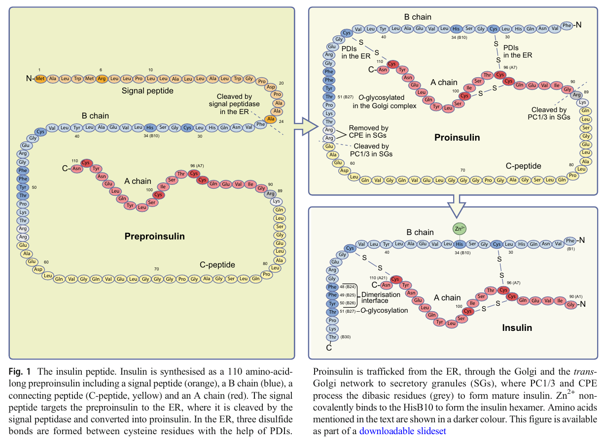

# Background research into insulin

- Insulin formed as preproinsulin (110 aa)[^1]
- Eventually cleaved into insulin: heterodimer with 21 and 30 chains

## References

[^1]: Vasiljević, Jovana, Juha M. Torkko, Klaus-Peter Knoch, and Michele Solimena. “The Making of Insulin in Health and Disease.” Diabetologia 63, no. 10 (October 2020): 1981–89. https://doi.org/10.1007/s00125-020-05192-7.
